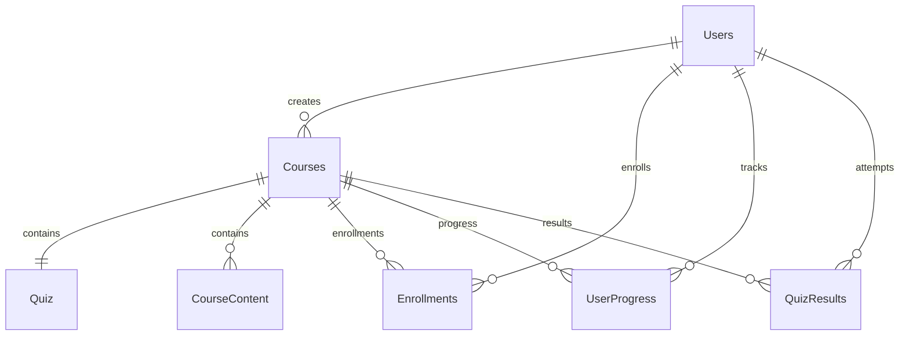
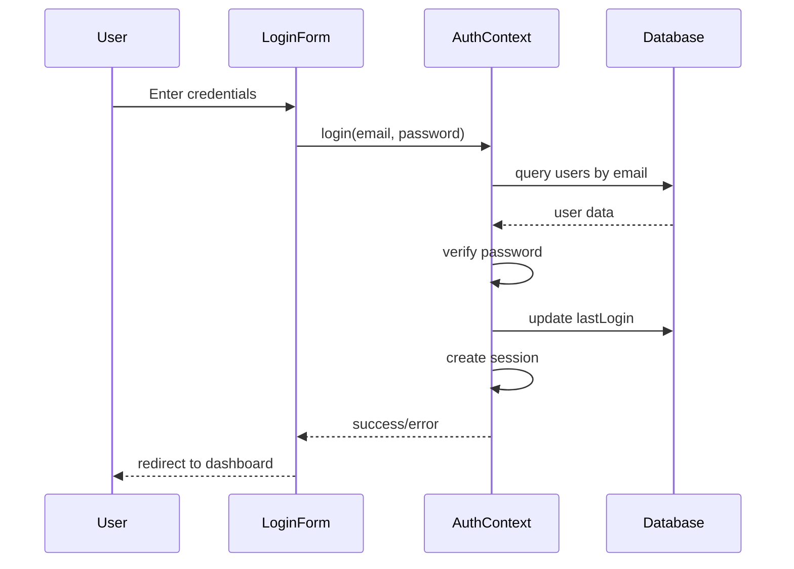
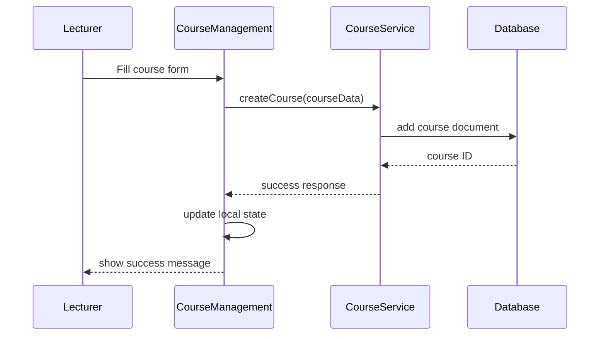
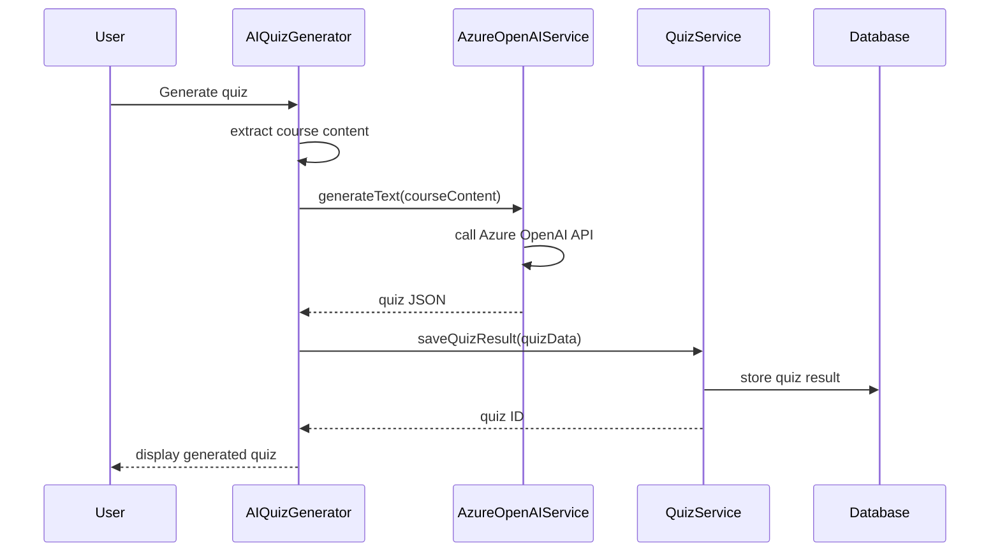
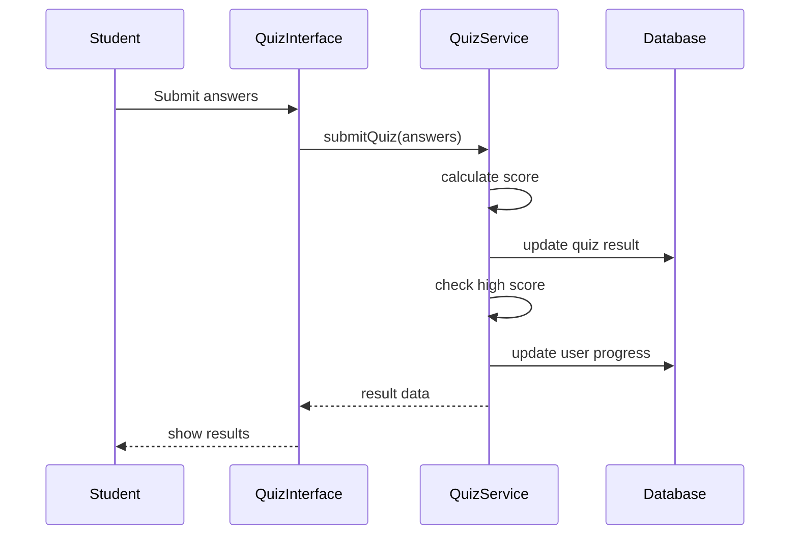
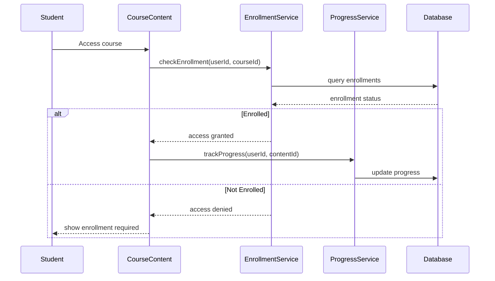

# SmartLearn Empower Futures - Technical Documentation

## Table of Contents

1. [Project Overview](#project-overview)
2. [Architecture Description](#architecture-description)
3. [Setup and Installation](#setup-and-installation)
4. [Dependencies and External Integrations](#dependencies-and-external-integrations)
5. [API Endpoints and Services](#api-endpoints-and-services)
6. [Code Conventions and Patterns](#code-conventions-and-patterns)
7. [Database Schema and Data Models](#database-schema-and-data-models)
8. [Key Workflows and Data Flow](#key-workflows-and-data-flow)
9. [Security Considerations](#security-considerations)
10. [Authentication and Authorization](#authentication-and-authorization)
11. [User Interface Components](#user-interface-components)
12. [AI Integration](#ai-integration)
13. [Testing and Quality Assurance](#testing-and-quality-assurance)
14. [Future Improvements and Known Limitations](#future-improvements-and-known-limitations)
15. [Deployment and Production Considerations](#deployment-and-production-considerations)

---

## Project Overview

**SmartLearn Empower Futures** is a comprehensive Learning Management System (LMS) built as a modern web application. The platform enables educational institutions, instructors, and learners to create, manage, and consume educational content with advanced AI-powered features.

### Purpose
- **Educational Platform**: Provide a complete e-learning solution
- **AI-Enhanced Learning**: Intelligent quiz generation based on course content
- **Multi-Role System**: Support for students, lecturers, and administrators
- **Progressive Learning**: Track progress and provide personalized learning paths

### Key Features
- **Course Management**: Create, edit, and publish courses with multimedia content
- **AI Quiz Generation**: Dynamic quiz creation using Azure OpenAI
- **Progress Tracking**: Comprehensive analytics and progress monitoring
- **User Management**: Role-based access control and user administration
- **Voice Commands**: Accessibility features with voice navigation
- **Responsive Design**: Mobile-first approach with modern UI components

---

## Architecture Description

### Technology Stack
- **Frontend Framework**: React 18 with TypeScript
- **Build Tool**: Vite 5.4.1
- **UI Framework**: Tailwind CSS with shadcn/ui components
- **State Management**: React Context API with local state
- **Database**: IndexedDB (client-side) with planned Firebase Firestore integration
- **HTTP Client**: Axios for API communications
- **Routing**: React Router DOM v6

### Application Layers

#### 1. Presentation Layer (`src/components/`)
- **UI Components**: Reusable shadcn/ui components in `src/components/ui/`
- **Feature Components**: Business logic components for specific features
- **Layout Components**: Headers, navigation, and structural elements

#### 2. Business Logic Layer (`src/services/`)
- **Course Service**: Course creation, management, and content handling
- **Quiz Service**: Quiz generation, submission, and analytics
- **User Service**: Authentication, profile management, and permissions
- **AI Service**: Integration with Azure OpenAI for content generation

#### 3. Data Access Layer (`src/lib/`)
- **Database Wrapper**: IndexedDB abstraction layer
- **Firebase Integration**: Firestore integration (planned/in development)
- **Data Seeding**: Initial data population utilities

#### 4. Context Layer (`src/contexts/`)
- **Authentication Context**: User session and role management
- **Application State**: Global state management for courses and user data

### Module Organization
```
src/
├── components/          # React components
│   ├── ui/             # Reusable UI components (shadcn/ui)
│   └── [feature]/      # Feature-specific components
├── contexts/           # React Context providers
├── services/           # Business logic and API services
├── lib/               # Utilities and database wrappers
├── types/             # TypeScript type definitions
├── hooks/             # Custom React hooks
├── utils/             # Helper functions and utilities
├── data/              # Static data and seed files
└── pages/             # Route components
```

---

## Setup and Installation

### Prerequisites
- **Node.js**: Version 18 or higher
- **Package Manager**: npm, yarn, or bun
- **Browser**: Modern browser with IndexedDB support

### Installation Steps

1. **Clone the Repository**
   ```bash
   git clone <repository-url>
   cd smartlearn-empower-futures
   ```

2. **Install Dependencies**
   ```bash
   npm install
   # or
   yarn install
   # or
   bun install
   ```

3. **Environment Configuration**
   Create a `.env` file in the root directory:
   ```env
   # Azure OpenAI Configuration (Optional)
   VITE_AZURE_OPENAI_API_KEY=your_api_key_here
   VITE_AZURE_OPENAI_ENDPOINT=https://your-resource.openai.azure.com/
   VITE_AZURE_OPENAI_DEPLOYMENT_NAME=your_deployment_name
   VITE_AZURE_OPENAI_API_VERSION=2023-05-15
   
   # OpenAI Configuration (Alternative)
   VITE_OPENAI_API_KEY=your_openai_api_key
   VITE_OPENAI_MODEL=gpt-4o-mini
   ```

4. **Development Server**
   ```bash
   npm run dev
   # Application will be available at http://localhost:8080
   ```

5. **Build for Production**
   ```bash
   npm run build
   npm run preview
   ```

### Default User Accounts
The application includes seeded demo accounts:
- **Admin**: admin@smartlearn.com / admin123
- **Lecturer**: lecturer@smartlearn.com / lecturer123
- **Student**: student@smartlearn.com / student123

---

## Dependencies and External Integrations

### Core Dependencies

#### Frontend Framework
```json
{
  "react": "^18.3.1",
  "react-dom": "^18.3.1",
  "react-router-dom": "^6.26.2",
  "typescript": "^5.5.3"
}
```

#### UI and Styling
```json
{
  "tailwindcss": "^3.4.11",
  "@radix-ui/react-*": "Latest versions",
  "lucide-react": "^0.462.0",
  "class-variance-authority": "^0.7.1",
  "tailwind-merge": "^2.5.2"
}
```

#### Data Management
```json
{
  "axios": "^1.11.0",
  "@tanstack/react-query": "^5.56.2",
  "zod": "^3.23.8"
}
```

#### AI and Content Processing
```json
{
  "react-markdown": "^10.1.0",
  "rehype-highlight": "^7.0.2",
  "remark-gfm": "^4.0.1"
}
```

### External Service Integrations

#### 1. Azure OpenAI Service
- **Purpose**: AI-powered quiz generation
- **Configuration**: Environment variables for endpoint and API key
- **Fallback**: Mock responses when not configured
- **Models Supported**: GPT-4, GPT-4o-mini, and other Azure OpenAI deployments

#### 2. Netlify Functions (Optional)
- **Purpose**: Serverless API proxy for OpenAI requests
- **Location**: `netlify/functions/openai-proxy.js`
- **Use Case**: Alternative to direct Azure OpenAI integration

#### 3. IndexedDB
- **Purpose**: Client-side data persistence
- **Implementation**: Custom wrapper in `src/lib/database.ts`
- **Collections**: courses, users, enrollments, userProgress, quizResults

---

## API Endpoints and Services

### Service Architecture

#### 1. Course Service (`src/services/courseService.ts`)
**Purpose**: Manage course lifecycle and content

**Methods**:
```typescript
// Course Management
createCourse(course: Omit<Course, 'id'>, userId: string): Promise<{firebaseId: string, id: string}>
updateCourse(courseId: string, updates: Partial<Course>): Promise<void>
deleteCourse(courseId: string): Promise<void>
getCourse(courseId: string): Promise<Course | null>
getCourses(filters?: CourseFilters): Promise<Course[]>

// Content Management
addCourseContent(courseId: string, content: CourseContent, userId: string): Promise<string>
updateCourseContent(courseId: string, content: CourseContent, userId: string): Promise<void>
deleteCourseContent(courseId: string, contentId: string, userId: string): Promise<void>

// Quiz Management
updateCourseQuiz(courseId: string, quiz: Quiz, userId: string): Promise<void>
deleteCourseQuiz(courseId: string, quizId: string, userId: string): Promise<void>
```

#### 2. Quiz Service (`src/services/quizService.ts`)
**Purpose**: Handle quiz generation, submission, and analytics

**Methods**:
```typescript
// Quiz Generation
generateQuiz(courseId: string, courseContent: string): Promise<Quiz>
saveQuizResult(result: QuizResult): Promise<string>

// Quiz Analytics
getQuizAnalytics(courseId: string): Promise<QuizAnalytics>
getLeaderboard(courseId: string, limit?: number): Promise<LeaderboardEntry[]>
getUserQuizHistory(userId: string): Promise<QuizResult[]>
```

#### 3. Authentication Service (`src/contexts/AuthContext.tsx`)
**Purpose**: User authentication and session management

**Methods**:
```typescript
login(email: string, password: string): Promise<void>
signup(email: string, password: string, role: UserRole, firstName?: string, lastName?: string): Promise<void>
logout(): Promise<void>
updateProfile(updates: Partial<UserProfile>): Promise<void>
```

#### 4. Azure OpenAI Service (`src/services/azureOpenAIService.ts`)
**Purpose**: AI content generation

**Configuration**:
```typescript
interface AzureOpenAIConfig {
  apiKey: string;
  endpoint: string;
  deploymentName: string;
  apiVersion: string;
}
```

**Request/Response Format**:
```typescript
// Request
interface Message {
  role: 'system' | 'user' | 'assistant';
  content: string;
}

// Response
generateText(messages: Message[]): Promise<string>
```

### Data Transfer Objects

#### Course Creation Request
```typescript
interface CourseCreateRequest {
  title: string;
  description: string;
  category: string;
  level: 'Beginner' | 'Intermediate' | 'Advanced';
  duration: string;
  instructor: string;
  thumbnail: string;
  status: 'draft' | 'published' | 'archived';
}
```

#### Quiz Submission Request
```typescript
interface QuizSubmission {
  questions: {
    questionId: string;
    selectedOptionId: number;
  }[];
}
```

---

## Code Conventions and Patterns

### TypeScript Conventions
- **Strict Mode**: Enabled with strict type checking
- **Interface Naming**: PascalCase with descriptive names
- **Generic Types**: Used for reusable components and services
- **Null Safety**: Optional chaining and nullish coalescing

### React Patterns

#### 1. Functional Components
```typescript
// Component with props interface
interface ComponentProps {
  title: string;
  onAction: () => void;
}

const Component: React.FC<ComponentProps> = ({ title, onAction }) => {
  return <div>{title}</div>;
};
```

#### 2. Custom Hooks
```typescript
// Custom hook for data fetching
const useCourse = (courseId: string) => {
  const [course, setCourse] = useState<Course | null>(null);
  const [loading, setLoading] = useState(true);
  
  useEffect(() => {
    // Fetch logic
  }, [courseId]);
  
  return { course, loading };
};
```

#### 3. Context Pattern
```typescript
// Context with provider pattern
const AuthContext = createContext<AuthContextType | undefined>(undefined);

export const useAuth = () => {
  const context = useContext(AuthContext);
  if (!context) {
    throw new Error('useAuth must be used within AuthProvider');
  }
  return context;
};
```

### Styling Conventions

#### 1. Tailwind CSS Classes
- **Responsive Design**: Mobile-first approach with breakpoint prefixes
- **Component Variants**: Using `class-variance-authority` for component variants
- **Custom CSS Properties**: CSS variables for theme colors

#### 2. Component Library Integration
```typescript
// shadcn/ui component usage
import { Button } from "@/components/ui/button";
import { Card, CardContent, CardHeader, CardTitle } from "@/components/ui/card";
```

### File Organization Patterns

#### 1. Component Structure
```typescript
// ComponentName.tsx
import React from 'react';
import { ComponentProps } from './types';
import './ComponentName.styles.css'; // If needed

const ComponentName: React.FC<ComponentProps> = (props) => {
  // Component logic
  return (
    // JSX
  );
};

export default ComponentName;
```

#### 2. Service Structure
```typescript
// serviceModule.ts
export class ServiceName {
  private config: ServiceConfig;
  
  constructor(config?: ServiceConfig) {
    this.config = config || defaultConfig;
  }
  
  async method(): Promise<ReturnType> {
    // Implementation
  }
}

export const serviceInstance = new ServiceName();
```

---

## Database Schema and Data Models

### IndexedDB Collections

#### 1. Users Collection
```typescript
interface UserProfile {
  id: string;                    // Unique user identifier
  email: string;                 // User email (unique)
  role: 'student' | 'lecturer' | 'admin';
  firstName?: string;
  lastName?: string;
  password: string;              // Hashed password
  createdAt: string;            // ISO date string
  lastLogin?: string;           // ISO date string
}
```

#### 2. Courses Collection
```typescript
interface Course {
  id: string;                   // Unique course identifier
  firebaseId?: string;          // Firebase document ID (when integrated)
  title: string;
  description: string;
  category: string;
  level: 'Beginner' | 'Intermediate' | 'Advanced';
  duration: string;
  rating: number;               // Average rating (0-5)
  ratingCount?: number;         // Number of ratings
  students: number;             // Enrolled student count
  instructor: string;
  thumbnail: string;
  content: CourseContent[];     // Embedded content array
  quiz: Quiz;                   // Embedded quiz object
  status: 'draft' | 'published' | 'archived';
  createdAt?: Date;            // Creation timestamp
  updatedAt?: Date;            // Last update timestamp
  createdBy?: string;          // Creator user ID
}
```

#### 3. Course Content Structure
```typescript
interface CourseContent {
  id: string;                   // Unique content identifier
  title: string;
  type: 'text' | 'video' | 'pdf';
  duration: string;
  content: string;              // Text content or description
  videoUrl?: string;            // Video URL for video type
  url?: string;                 // Generic URL for resources
}
```

#### 4. Quiz Structure
```typescript
interface Quiz {
  id: string;                   // Unique quiz identifier
  title: string;
  courseId?: string;            // Associated course ID
  questions: QuizQuestion[];
}

interface QuizQuestion {
  id: string;                   // Unique question identifier
  question: string;             // Question text
  options: string[];            // Array of answer options
  correctAnswer: number;        // Index of correct option
  explanation?: string;         // Explanation for the answer
}
```

#### 5. Quiz Results Collection
```typescript
interface QuizResult {
  id: string;                   // Unique result identifier
  userId: string;               // User who took the quiz
  courseId: string;             // Associated course
  scenarioText: string;         // AI-generated scenario
  questionsJson: string;        // Serialized quiz questions
  score: number;                // Score percentage (0-100)
  generatedAt: Date;            // When quiz was generated
  attemptedAt: Date | null;     // When quiz was attempted
  isCompleted: boolean;         // Completion status
}
```

#### 6. Enrollments Collection
```typescript
interface CourseEnrollment {
  id: string;                   // Unique enrollment identifier
  userId: string;               // Enrolled user ID
  courseId: string;             // Course ID
  enrollmentDate: Date;         // Enrollment timestamp
  status: 'active' | 'completed' | 'dropped';
}
```

#### 7. User Progress Collection
```typescript
interface UserProgress {
  id: string;                   // Unique progress identifier
  userId: string;               // User ID
  courseId: string;             // Course ID
  completedContent: string[];   // Array of completed content IDs
  completionPercentage: number; // Progress percentage (0-100)
  lastAccessed: Date;           // Last access timestamp
}
```

### Data Relationships



---

## Key Workflows and Data Flow

### 1. User Authentication Flow



### 2. Course Creation Workflow



### 3. AI Quiz Generation Flow



### 4. Quiz Submission and Scoring



### 5. Course Content Access Control



---

## Security Considerations

### Authentication Security

#### 1. Password Security
- **Hashing**: Basic Base64 encoding with salt (⚠️ **Production Note**: Should use bcrypt or Argon2)
- **Session Management**: Local storage with timestamp validation
- **Session Expiry**: 24-hour session timeout

```typescript
// Current implementation (for development)
const hashPassword = (password: string): string => {
  return btoa(password + 'salt_key_123');
};

// Recommended for production
// const hashPassword = async (password: string): Promise<string> => {
//   return await bcrypt.hash(password, 12);
// };
```

#### 2. Session Management
```typescript
// Session storage with expiry
const createSession = (userId: string) => {
  localStorage.setItem('auth_session', JSON.stringify({
    userId,
    timestamp: new Date().getTime()
  }));
};

// Session validation
const validateSession = () => {
  const sessionData = localStorage.getItem('auth_session');
  if (sessionData) {
    const { timestamp } = JSON.parse(sessionData);
    const now = new Date().getTime();
    const twentyFourHours = 24 * 60 * 60 * 1000;
    return (now - timestamp) < twentyFourHours;
  }
  return false;
};
```

### API Security

#### 1. Environment Variable Protection
```typescript
// Client-side environment variables (prefixed with VITE_)
const apiKey = import.meta.env.VITE_AZURE_OPENAI_API_KEY;

// Note: Client-side variables are exposed in the browser
// For production, use server-side proxy for sensitive operations
```

#### 2. Input Validation
```typescript
// Zod schema validation
import { z } from 'zod';

const CourseSchema = z.object({
  title: z.string().min(1).max(200),
  description: z.string().min(10).max(1000),
  category: z.string().min(1),
  level: z.enum(['Beginner', 'Intermediate', 'Advanced'])
});
```

### Data Protection

#### 1. Client-Side Storage
- **IndexedDB**: Encrypted storage recommended for production
- **Local Storage**: Session data only, with expiry
- **No Sensitive Data**: Passwords are hashed before storage

#### 2. Cross-Site Scripting (XSS) Prevention
```typescript
// React's built-in XSS protection
// Automatic escaping of user input
const UserContent = ({ content }: { content: string }) => {
  return <div>{content}</div>; // Automatically escaped
};

// For HTML content, use sanitization
import DOMPurify from 'dompurify';
const SafeHTML = ({ html }: { html: string }) => {
  return <div dangerouslySetInnerHTML={{ __html: DOMPurify.sanitize(html) }} />;
};
```

### Production Security Recommendations

1. **Server-Side Authentication**: Implement JWT tokens with server-side validation
2. **API Rate Limiting**: Implement rate limiting for API endpoints
3. **HTTPS Enforcement**: Force HTTPS in production
4. **Content Security Policy**: Implement CSP headers
5. **Database Security**: Use proper database authentication and encryption
6. **Secret Management**: Use secure secret management services

---

## Authentication and Authorization

### Role-Based Access Control (RBAC)

#### User Roles
```typescript
type UserRole = 'student' | 'lecturer' | 'admin';

interface RolePermissions {
  canCreateCourses: boolean;
  canEditAllCourses: boolean;
  canDeleteCourses: boolean;
  canManageUsers: boolean;
  canViewAnalytics: boolean;
  canAccessDebugTools: boolean;
}

const getRolePermissions = (role: UserRole): RolePermissions => {
  switch (role) {
    case 'admin':
      return {
        canCreateCourses: true,
        canEditAllCourses: true,
        canDeleteCourses: true,
        canManageUsers: true,
        canViewAnalytics: true,
        canAccessDebugTools: true
      };
    case 'lecturer':
      return {
        canCreateCourses: true,
        canEditAllCourses: false, // Only own courses
        canDeleteCourses: false,  // Only own courses
        canManageUsers: false,
        canViewAnalytics: false,
        canAccessDebugTools: false
      };
    case 'student':
      return {
        canCreateCourses: false,
        canEditAllCourses: false,
        canDeleteCourses: false,
        canManageUsers: false,
        canViewAnalytics: false,
        canAccessDebugTools: false
      };
  }
};
```

#### Authorization Guards
```typescript
// Component-level authorization
const ProtectedComponent: React.FC = () => {
  const { currentUser } = useAuth();
  
  if (!currentUser) {
    return <LoginForm />;
  }
  
  if (currentUser.role !== 'admin') {
    return <AccessDenied />;
  }
  
  return <AdminDashboard />;
};

// Hook-based authorization
const useRequireAuth = (requiredRole?: UserRole) => {
  const { currentUser } = useAuth();
  
  useEffect(() => {
    if (!currentUser) {
      // Redirect to login
    }
    
    if (requiredRole && currentUser.role !== requiredRole) {
      // Show access denied
    }
  }, [currentUser, requiredRole]);
  
  return currentUser;
};
```

#### Route Protection
```typescript
// Protected Route component
const ProtectedRoute: React.FC<{
  children: React.ReactNode;
  requiredRole?: UserRole;
}> = ({ children, requiredRole }) => {
  const { currentUser } = useAuth();
  
  if (!currentUser) {
    return <Navigate to="/login" />;
  }
  
  if (requiredRole && currentUser.role !== requiredRole) {
    return <AccessDenied />;
  }
  
  return <>{children}</>;
};
```

### Dashboard Role-Based Navigation

```typescript
// Dynamic dashboard based on user role
const Dashboard: React.FC<{ userRole: UserRole }> = ({ userRole }) => {
  const tabs = useMemo(() => {
    const baseTabs = [
      { value: 'courses', label: 'Courses', icon: BookOpen }
    ];
    
    if (userRole === 'student') {
      baseTabs.push({ value: 'progress', label: 'Progress', icon: TrendingUp });
    }
    
    if (userRole === 'lecturer' || userRole === 'admin') {
      baseTabs.push({ value: 'management', label: 'Management', icon: Settings });
    }
    
    if (userRole === 'admin') {
      baseTabs.push(
        { value: 'users', label: 'Users', icon: Users },
        { value: 'analytics', label: 'Analytics', icon: BarChart }
      );
    }
    
    return baseTabs;
  }, [userRole]);
  
  return (
    <Tabs>
      <TabsList>
        {tabs.map(tab => (
          <TabsTrigger key={tab.value} value={tab.value}>
            <tab.icon className="h-4 w-4 mr-2" />
            {tab.label}
          </TabsTrigger>
        ))}
      </TabsList>
    </Tabs>
  );
};
```

---

## User Interface Components

### Component Library Architecture

#### 1. Base UI Components (`src/components/ui/`)
Built on Radix UI primitives with Tailwind CSS styling:

```typescript
// Button component with variants
const Button = React.forwardRef<
  HTMLButtonElement,
  ButtonProps
>(({ className, variant, size, asChild = false, ...props }, ref) => {
  const Comp = asChild ? Slot : "button";
  return (
    <Comp
      className={cn(buttonVariants({ variant, size, className }))}
      ref={ref}
      {...props}
    />
  );
});

const buttonVariants = cva(
  "inline-flex items-center justify-center rounded-md text-sm font-medium",
  {
    variants: {
      variant: {
        default: "bg-primary text-primary-foreground hover:bg-primary/90",
        destructive: "bg-destructive text-destructive-foreground hover:bg-destructive/90",
        outline: "border border-input bg-background hover:bg-accent",
        secondary: "bg-secondary text-secondary-foreground hover:bg-secondary/80",
        ghost: "hover:bg-accent hover:text-accent-foreground",
        link: "text-primary underline-offset-4 hover:underline",
      },
      size: {
        default: "h-10 px-4 py-2",
        sm: "h-9 rounded-md px-3",
        lg: "h-11 rounded-md px-8",
        icon: "h-10 w-10",
      },
    },
    defaultVariants: {
      variant: "default",
      size: "default",
    },
  }
);
```

#### 2. Feature Components

**Course Management Interface**:
```typescript
const CourseManagement: React.FC<{
  userRole: UserRole;
  courses: Course[];
  onCoursesUpdate: (courses: Course[]) => void;
}> = ({ userRole, courses, onCoursesUpdate }) => {
  // Component implementation with tabs for:
  // - Course list
  // - Content management
  // - Quiz management
};
```

**AI Quiz Generator**:
```typescript
const AIQuizGenerator: React.FC<{
  courseId: string;
  courseTitle: string;
  onQuizComplete: (score: number) => void;
  isLecturer: boolean;
}> = ({ courseId, courseTitle, onQuizComplete, isLecturer }) => {
  // AI-powered quiz generation with real-time progress
};
```

### Responsive Design Patterns

#### 1. Mobile-First Approach
```css
/* Tailwind CSS classes for responsive design */
.grid-responsive {
  @apply grid grid-cols-1 md:grid-cols-2 lg:grid-cols-3 xl:grid-cols-4;
}

.card-responsive {
  @apply w-full max-w-sm md:max-w-md lg:max-w-lg;
}
```

#### 2. Adaptive Layouts
```typescript
// Hook for responsive breakpoints
const useBreakpoint = () => {
  const [breakpoint, setBreakpoint] = useState('sm');
  
  useEffect(() => {
    const updateBreakpoint = () => {
      const width = window.innerWidth;
      if (width >= 1024) setBreakpoint('lg');
      else if (width >= 768) setBreakpoint('md');
      else setBreakpoint('sm');
    };
    
    updateBreakpoint();
    window.addEventListener('resize', updateBreakpoint);
    return () => window.removeEventListener('resize', updateBreakpoint);
  }, []);
  
  return breakpoint;
};
```

### Accessibility Features

#### 1. Voice Commands
```typescript
// Voice command integration
const useVoiceCommands = () => {
  const recognition = useMemo(() => {
    if ('webkitSpeechRecognition' in window) {
      const recognition = new webkitSpeechRecognition();
      recognition.continuous = true;
      recognition.interimResults = false;
      recognition.lang = 'en-US';
      return recognition;
    }
    return null;
  }, []);
  
  const startListening = useCallback(() => {
    if (recognition) {
      recognition.start();
    }
  }, [recognition]);
  
  return { startListening, recognition };
};
```

#### 2. Keyboard Navigation
```typescript
// Keyboard shortcuts
const useKeyboardShortcuts = () => {
  useEffect(() => {
    const handleKeyDown = (event: KeyboardEvent) => {
      if (event.ctrlKey || event.metaKey) {
        switch (event.key) {
          case 's':
            event.preventDefault();
            // Save action
            break;
          case 'n':
            event.preventDefault();
            // New item action
            break;
        }
      }
    };
    
    document.addEventListener('keydown', handleKeyDown);
    return () => document.removeEventListener('keydown', handleKeyDown);
  }, []);
};
```

---

## AI Integration

### Azure OpenAI Service Implementation

#### Configuration and Setup
```typescript
class AzureOpenAIService {
  private apiKey: string;
  private endpoint: string;
  private deploymentName: string;
  private apiVersion: string;
  
  constructor() {
    this.apiKey = import.meta.env.VITE_AZURE_OPENAI_API_KEY || '';
    this.endpoint = import.meta.env.VITE_AZURE_OPENAI_ENDPOINT || '';
    this.deploymentName = import.meta.env.VITE_AZURE_OPENAI_DEPLOYMENT_NAME || 'gpt-4o-mini';
    this.apiVersion = import.meta.env.VITE_AZURE_OPENAI_API_VERSION || '2023-05-15';
  }
  
  async generateText(messages: Message[]): Promise<string> {
    const url = `${this.endpoint}/openai/deployments/${this.deploymentName}/chat/completions?api-version=${this.apiVersion}`;
    
    const response = await fetch(url, {
      method: 'POST',
      headers: {
        'Content-Type': 'application/json',
        'api-key': this.apiKey
      },
      body: JSON.stringify({
        messages,
        max_tokens: 2000,
        temperature: 0.7
      })
    });
    
    const data = await response.json();
    return data.choices[0].message.content;
  }
}
```

#### Quiz Generation Workflow
```typescript
const generateContextualQuiz = async (courseContent: string, courseTitle: string) => {
  const prompt = `
    Based on the following course content, generate 5 multiple-choice questions.
    
    Course: ${courseTitle}
    Content: ${courseContent}
    
    Return ONLY a valid JSON array with this structure:
    [
      {
        "id": 1,
        "text": "Question text here",
        "options": [
          {
            "id": 1,
            "text": "Option 1",
            "isCorrect": false,
            "explanation": "Why this is wrong"
          },
          {
            "id": 2,
            "text": "Option 2", 
            "isCorrect": true,
            "explanation": "Why this is correct"
          }
        ]
      }
    ]
  `;
  
  const messages: Message[] = [
    { role: 'system', content: 'You are an expert educational content creator.' },
    { role: 'user', content: prompt }
  ];
  
  return await azureOpenAIService.generateText(messages);
};
```

#### Fallback Mechanisms
```typescript
// Graceful degradation when AI service unavailable
const generateQuizWithFallback = async (courseContent: string) => {
  try {
    // Attempt AI generation
    const aiResponse = await azureOpenAIService.generateText(messages);
    return JSON.parse(aiResponse);
  } catch (error) {
    console.warn('AI service unavailable, using fallback quiz');
    return getMockQuizQuestions(courseContent);
  }
};

const getMockQuizQuestions = (content: string) => {
  // Static quiz questions based on content analysis
  return [
    {
      id: 1,
      text: "Based on the course content, what is the main topic?",
      options: [
        { id: 1, text: "Programming", isCorrect: true, explanation: "Correct based on content analysis" },
        { id: 2, text: "Mathematics", isCorrect: false, explanation: "Not the primary focus" }
      ]
    }
  ];
};
```

### Content Processing Pipeline

#### 1. Content Extraction
```typescript
const extractCourseContent = (course: Course): string => {
  const contentText = course.content
    .map(content => `${content.title}: ${content.content}`)
    .join('\n\n');
    
  const description = `Course: ${course.title}\nDescription: ${course.description}`;
  
  return `${description}\n\n${contentText}`;
};
```

#### 2. Content Chunking for Large Courses
```typescript
const chunkContent = (content: string, maxTokens: number = 3000): string[] => {
  const sentences = content.split('. ');
  const chunks: string[] = [];
  let currentChunk = '';
  
  for (const sentence of sentences) {
    const potentialChunk = currentChunk + sentence + '. ';
    
    // Rough token estimation (1 token ≈ 4 characters)
    if (potentialChunk.length * 0.25 > maxTokens && currentChunk) {
      chunks.push(currentChunk.trim());
      currentChunk = sentence + '. ';
    } else {
      currentChunk = potentialChunk;
    }
  }
  
  if (currentChunk.trim()) {
    chunks.push(currentChunk.trim());
  }
  
  return chunks;
};
```

---

## Testing and Quality Assurance

### Code Quality Tools

#### 1. ESLint Configuration
```json
{
  "extends": [
    "@eslint/js/recommended",
    "@typescript-eslint/recommended",
    "plugin:react-hooks/recommended"
  ],
  "rules": {
    "no-unused-vars": "error",
    "@typescript-eslint/no-explicit-any": "warn",
    "react-hooks/exhaustive-deps": "warn"
  }
}
```

#### 2. TypeScript Configuration
```json
{
  "compilerOptions": {
    "strict": true,
    "noImplicitAny": true,
    "strictNullChecks": true,
    "noImplicitReturns": true,
    "noFallthroughCasesInSwitch": true
  }
}
```

### Testing Strategy

#### 1. Component Testing (Recommended)
```typescript
// Example test structure using React Testing Library
import { render, screen, fireEvent } from '@testing-library/react';
import { AuthProvider } from '@/contexts/AuthContext';
import CourseCard from '@/components/CourseCard';

const renderWithAuth = (component: React.ReactElement) => {
  return render(
    <AuthProvider>
      {component}
    </AuthProvider>
  );
};

describe('CourseCard', () => {
  const mockCourse = {
    id: '1',
    title: 'Test Course',
    description: 'Test Description',
    category: 'Programming',
    level: 'Beginner',
    rating: 4.5,
    students: 100
  };
  
  test('renders course information correctly', () => {
    renderWithAuth(<CourseCard course={mockCourse} />);
    
    expect(screen.getByText('Test Course')).toBeInTheDocument();
    expect(screen.getByText('Test Description')).toBeInTheDocument();
    expect(screen.getByText('Beginner')).toBeInTheDocument();
  });
  
  test('handles enrollment action', () => {
    const onEnroll = jest.fn();
    renderWithAuth(<CourseCard course={mockCourse} onEnroll={onEnroll} />);
    
    fireEvent.click(screen.getByText('Enroll Now'));
    expect(onEnroll).toHaveBeenCalledWith(mockCourse.id);
  });
});
```

#### 2. Service Testing
```typescript
// Mock implementation for testing
jest.mock('@/lib/database', () => ({
  db: {
    add: jest.fn(),
    get: jest.fn(),
    getAll: jest.fn(),
    update: jest.fn(),
    delete: jest.fn(),
    query: jest.fn()
  }
}));

describe('CourseService', () => {
  beforeEach(() => {
    jest.clearAllMocks();
  });
  
  test('creates course successfully', async () => {
    const mockCourse = { title: 'Test Course' };
    const mockResult = { id: '123', firebaseId: 'abc' };
    
    (db.add as jest.Mock).mockResolvedValue(mockResult);
    
    const result = await courseService.createCourse(mockCourse, 'user123');
    
    expect(db.add).toHaveBeenCalledWith('courses', expect.objectContaining({
      ...mockCourse,
      createdBy: 'user123'
    }));
    expect(result).toEqual(mockResult);
  });
});
```

### Error Handling Patterns

#### 1. Service Error Handling
```typescript
class ServiceError extends Error {
  constructor(
    message: string,
    public code: string,
    public statusCode?: number
  ) {
    super(message);
    this.name = 'ServiceError';
  }
}

const handleServiceError = (error: unknown): ServiceError => {
  if (error instanceof ServiceError) {
    return error;
  }
  
  if (error instanceof Error) {
    return new ServiceError(error.message, 'UNKNOWN_ERROR');
  }
  
  return new ServiceError('An unknown error occurred', 'UNKNOWN_ERROR');
};
```

#### 2. Component Error Boundaries
```typescript
class ErrorBoundary extends React.Component<
  { children: React.ReactNode },
  { hasError: boolean; error?: Error }
> {
  constructor(props: { children: React.ReactNode }) {
    super(props);
    this.state = { hasError: false };
  }
  
  static getDerivedStateFromError(error: Error) {
    return { hasError: true, error };
  }
  
  componentDidCatch(error: Error, errorInfo: React.ErrorInfo) {
    console.error('Component error:', error, errorInfo);
    // Log to error reporting service
  }
  
  render() {
    if (this.state.hasError) {
      return (
        <div className="error-boundary">
          <h2>Something went wrong</h2>
          <p>{this.state.error?.message}</p>
          <button onClick={() => this.setState({ hasError: false })}>
            Try again
          </button>
        </div>
      );
    }
    
    return this.props.children;
  }
}
```

---

## Future Improvements and Known Limitations

### Current Limitations

#### 1. Security Concerns
- **Password Hashing**: Currently using Base64 encoding (development only)
  - **Solution**: Implement bcrypt or Argon2 for production
  - **Timeline**: High priority for production deployment

- **Client-Side Storage**: Sensitive operations performed on client
  - **Solution**: Move authentication to server-side with JWT tokens
  - **Timeline**: Medium priority

#### 2. Scalability Issues
- **IndexedDB Limitations**: Browser storage limits (~1GB)
  - **Solution**: Migrate to Firebase Firestore (partially implemented)
  - **Timeline**: In progress

- **AI Service Rate Limits**: No rate limiting implemented
  - **Solution**: Implement request queuing and rate limiting
  - **Timeline**: Medium priority

#### 3. User Experience
- **Offline Support**: Limited offline functionality
  - **Solution**: Implement service worker for offline course access
  - **Timeline**: Low priority

- **Real-time Features**: No real-time updates for collaborative features
  - **Solution**: WebSocket integration or Firebase real-time listeners
  - **Timeline**: Medium priority

### Planned Improvements

#### 1. Technical Enhancements

**Backend Migration**
```typescript
// Planned server-side architecture
interface APIResponse<T> {
  success: boolean;
  data?: T;
  error?: string;
  pagination?: {
    total: number;
    page: number;
    limit: number;
  };
}

// Express.js API structure
app.post('/api/auth/login', async (req, res) => {
  try {
    const { email, password } = req.body;
    const user = await authService.authenticate(email, password);
    const token = jwt.sign({ userId: user.id }, process.env.JWT_SECRET);
    
    res.json({
      success: true,
      data: { user, token }
    });
  } catch (error) {
    res.status(401).json({
      success: false,
      error: error.message
    });
  }
});
```

**Firebase Integration Enhancement**
- Complete migration from IndexedDB to Firestore
- Real-time data synchronization
- Improved offline support with Firestore offline persistence

#### 2. Feature Enhancements

**Advanced Analytics Dashboard**
```typescript
// Planned analytics features
interface AdvancedAnalytics {
  learningPaths: LearningPath[];
  engagementMetrics: EngagementMetric[];
  performanceTrends: PerformanceTrend[];
  recommendationEngine: CourseRecommendation[];
}

// Machine learning integration for personalized learning
const generatePersonalizedRecommendations = async (userId: string) => {
  const userProfile = await getUserLearningProfile(userId);
  const courseAnalytics = await getCourseAnalytics();
  
  // AI-based recommendation algorithm
  return recommendationEngine.predict(userProfile, courseAnalytics);
};
```

**Enhanced AI Features**
- Adaptive learning paths based on performance
- Natural language Q&A for course content
- AI-powered content creation assistance
- Automated grading and feedback

#### 3. Infrastructure Improvements

**Performance Optimization**
```typescript
// Code splitting for better performance
const CourseManagement = lazy(() => import('@/components/CourseManagement'));
const AnalyticsDashboard = lazy(() => import('@/components/AnalyticsDashboard'));

// Optimized image loading
const OptimizedImage: React.FC<{ src: string; alt: string }> = ({ src, alt }) => {
  return (
     {
        e.currentTarget.src = '/placeholder.svg';
      }}
    />
  );
};
```

**Monitoring and Observability**
```typescript
// Application performance monitoring
const performanceMonitor = {
  trackPageLoad: (pageName: string) => {
    const startTime = performance.now();
    return () => {
      const endTime = performance.now();
      analytics.track('page_load_time', {
        page: pageName,
        duration: endTime - startTime
      });
    };
  },
  
  trackError: (error: Error, context: string) => {
    errorReporting.captureException(error, {
      tags: { context },
      extra: { timestamp: new Date().toISOString() }
    });
  }
};
```

### Technology Roadmap

#### Short Term (1-3 months)
1. **Security Hardening**
   - Implement proper password hashing
   - Add input validation middleware
   - Set up HTTPS enforcement

2. **Firebase Migration**
   - Complete Firestore integration
   - Implement real-time data sync
   - Add offline support

3. **Testing Infrastructure**
   - Set up Jest and React Testing Library
   - Implement CI/CD pipeline
   - Add end-to-end testing with Playwright

#### Medium Term (3-6 months)
1. **Backend Development**
   - Node.js/Express API server
   - PostgreSQL database for production
   - Redis for caching and sessions

2. **Advanced Features**
   - Video streaming integration
   - Advanced analytics dashboard
   - Mobile app development (React Native)

3. **Performance Optimization**
   - CDN integration for static assets
   - Database query optimization
   - Caching strategy implementation

#### Long Term (6-12 months)
1. **AI Enhancement**
   - Custom ML models for learning recommendations
   - Natural language processing for content analysis
   - Automated content generation

2. **Enterprise Features**
   - Multi-tenant architecture
   - SCORM compliance
   - Advanced reporting and compliance tools

3. **Scalability**
   - Microservices architecture
   - Kubernetes deployment
   - Global CDN and edge computing

---

## Deployment and Production Considerations

### Build Configuration

#### Production Build Optimization
```typescript
// vite.config.ts for production
export default defineConfig(({ mode }) => ({
  build: {
    target: 'es2020',
    minify: 'esbuild',
    sourcemap: mode === 'development',
    rollupOptions: {
      output: {
        manualChunks: {
          vendor: ['react', 'react-dom', 'react-router-dom'],
          ui: ['@radix-ui/react-dialog', '@radix-ui/react-tabs'],
          utils: ['axios', 'date-fns', 'zod']
        }
      }
    }
  },
  define: {
    'process.env.NODE_ENV': JSON.stringify(mode)
  }
}));
```

#### Environment Configuration
```bash
# Production environment variables
VITE_API_BASE_URL=https://api.smartlearn.com
VITE_AZURE_OPENAI_ENDPOINT=https://your-prod-resource.openai.azure.com/
VITE_FIREBASE_CONFIG={"apiKey":"...","authDomain":"..."}
VITE_SENTRY_DSN=https://your-sentry-dsn
```

### Deployment Strategies

#### 1. Static Site Deployment (Current)
```yaml
# Netlify deployment configuration
build:
  command: npm run build
  publish: dist
  
redirect_rules:
  - from: "/*"
    to: "/index.html"
    status: 200
    
headers:
  - for: "*.js"
    values:
      Cache-Control: "public, max-age=31536000"
  - for: "*.css" 
    values:
      Cache-Control: "public, max-age=31536000"
```

#### 2. Full-Stack Deployment (Planned)
```dockerfile
# Dockerfile for production deployment
FROM node:18-alpine AS builder
WORKDIR /app
COPY package*.json ./
RUN npm ci --only=production
COPY . .
RUN npm run build

FROM nginx:alpine
COPY --from=builder /app/dist /usr/share/nginx/html
COPY nginx.conf /etc/nginx/nginx.conf
EXPOSE 80
CMD ["nginx", "-g", "daemon off;"]
```

#### 3. Container Orchestration
```yaml
# Kubernetes deployment
apiVersion: apps/v1
kind: Deployment
metadata:
  name: smartlearn-frontend
spec:
  replicas: 3
  selector:
    matchLabels:
      app: smartlearn-frontend
  template:
    metadata:
      labels:
        app: smartlearn-frontend
    spec:
      containers:
      - name: frontend
        image: smartlearn/frontend:latest
        ports:
        - containerPort: 80
        env:
        - name: VITE_API_BASE_URL
          valueFrom:
            configMapKeyRef:
              name: app-config
              key: api-url
```

### Monitoring and Logging

#### 1. Application Monitoring
```typescript
// Sentry integration for error tracking
import * as Sentry from "@sentry/react";

Sentry.init({
  dsn: import.meta.env.VITE_SENTRY_DSN,
  environment: import.meta.env.MODE,
  tracesSampleRate: 1.0,
});

// Performance monitoring
const performanceMonitor = {
  trackPageView: (page: string) => {
    Sentry.addBreadcrumb({
      message: `Page view: ${page}`,
      level: 'info',
      category: 'navigation'
    });
  }
};
```

#### 2. Analytics Integration
```typescript
// Google Analytics 4 integration
import { gtag } from 'ga-gtag';

const analytics = {
  trackEvent: (action: string, category: string, label?: string) => {
    gtag('event', action, {
      event_category: category,
      event_label: label,
      value: 1
    });
  },
  
  trackCourseCompletion: (courseId: string, completionRate: number) => {
    gtag('event', 'course_completion', {
      event_category: 'learning',
      course_id: courseId,
      completion_rate: completionRate
    });
  }
};
```

### Security Headers and CSP

```nginx
# Nginx security configuration
server {
    listen 443 ssl http2;
    server_name smartlearn.com;
    
    # Security headers
    add_header X-Frame-Options DENY;
    add_header X-Content-Type-Options nosniff;
    add_header X-XSS-Protection "1; mode=block";
    add_header Referrer-Policy "strict-origin-when-cross-origin";
    add_header Strict-Transport-Security "max-age=31536000; includeSubDomains";
    
    # Content Security Policy
    add_header Content-Security-Policy "
        default-src 'self';
        script-src 'self' 'unsafe-inline' https://cdn.jsdelivr.net;
        style-src 'self' 'unsafe-inline' https://fonts.googleapis.com;
        font-src 'self' https://fonts.gstatic.com;
        img-src 'self' data: https:;
        connect-src 'self' https://api.openai.com https://*.openai.azure.com;
    ";
    
    location / {
        try_files $uri $uri/ /index.html;
    }
}
```

### Performance Optimization

#### 1. Code Splitting and Lazy Loading
```typescript
// Route-based code splitting
const CourseManagement = lazy(() => import('@/components/CourseManagement'));
const AnalyticsDashboard = lazy(() => import('@/components/AnalyticsDashboard'));

const App = () => (
  <Suspense fallback={<LoadingSpinner />}>
    <Routes>
      <Route path="/management" element={<CourseManagement />} />
      <Route path="/analytics" element={<AnalyticsDashboard />} />
    </Routes>
  </Suspense>
);
```

#### 2. Service Worker for Caching
```typescript
// Service worker for offline support
const CACHE_NAME = 'smartlearn-v1';
const urlsToCache = [
  '/',
  '/static/js/bundle.js',
  '/static/css/main.css',
  '/manifest.json'
];

self.addEventListener('install', (event) => {
  event.waitUntil(
    caches.open(CACHE_NAME)
      .then((cache) => cache.addAll(urlsToCache))
  );
});

self.addEventListener('fetch', (event) => {
  event.respondWith(
    caches.match(event.request)
      .then((response) => {
        if (response) {
          return response;
        }
        return fetch(event.request);
      })
  );
});
```

### Backup and Disaster Recovery

#### 1. Database Backup Strategy
```typescript
// Automated backup for IndexedDB data
const createBackup = async () => {
  const backup = {
    timestamp: new Date().toISOString(),
    version: '1.0',
    data: {
      users: await db.getAll('users'),
      courses: await db.getAll('courses'),
      enrollments: await db.getAll('enrollments'),
      progress: await db.getAll('userProgress')
    }
  };
  
  // Store in browser download or cloud storage
  const blob = new Blob([JSON.stringify(backup)], { type: 'application/json' });
  return blob;
};
```

#### 2. Data Recovery Procedures
```typescript
// Data restoration from backup
const restoreFromBackup = async (backupFile: File) => {
  try {
    const backupData = JSON.parse(await backupFile.text());
    
    // Validate backup format
    if (!backupData.version || !backupData.data) {
      throw new Error('Invalid backup format');
    }
    
    // Restore data collections
    for (const [collection, data] of Object.entries(backupData.data)) {
      for (const item of data as any[]) {
        await db.add(collection, item);
      }
    }
    
    console.log('Data restored successfully');
  } catch (error) {
    console.error('Failed to restore backup:', error);
    throw error;
  }
};
```

---

## Conclusion

SmartLearn Empower Futures represents a modern, scalable approach to educational technology with intelligent features powered by AI. The current implementation provides a solid foundation for an LMS platform with room for significant enhancement and scaling.

### Key Strengths
- **Modern Technology Stack**: React, TypeScript, and modern tooling
- **AI Integration**: Azure OpenAI for intelligent content generation
- **Responsive Design**: Mobile-first approach with accessible UI
- **Role-Based Architecture**: Flexible user management system
- **Extensible Codebase**: Well-structured for future enhancements

### Immediate Priorities
1. **Security Enhancement**: Implement production-grade authentication
2. **Database Migration**: Complete Firebase Firestore integration
3. **Testing Infrastructure**: Comprehensive testing strategy
4. **Performance Optimization**: Code splitting and caching strategies

### Long-term Vision
The platform is positioned to evolve into a comprehensive educational ecosystem with advanced AI features, enterprise-grade security, and scalable infrastructure to serve educational institutions globally.

---

*This document represents the current state of the SmartLearn Empower Futures application as of the analysis date and should be updated as the system evolves.*